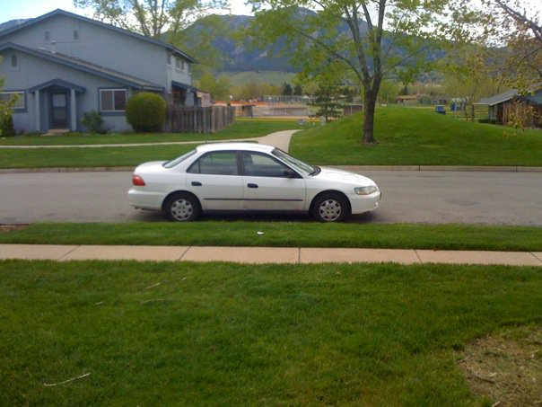
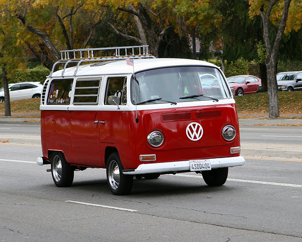
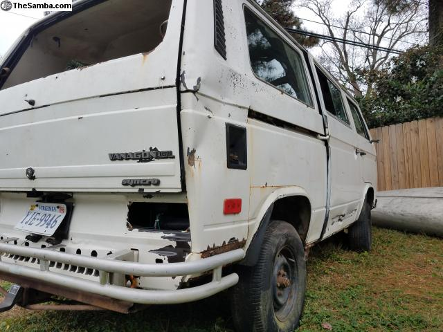

# So I'm thinking about getting a van.

--------------------------------------------------------------------------------

## Road trips

A long, long time ago, my family was a big fan of road trips.

My mom and dad were pretty frugal. They had an early [90's Dodge Caravan](https://en.wikipedia.org/wiki/Dodge_Caravan#Second_generation_.281991.E2.80.931995.29) with no cruise control and no A/C. There were two different places that we'd regularly take summer road trips to - my dad's side of the family that lived in Wisconsin, and my mom's side of the family that lived in the [Finger Lakes area of New York](https://www.google.com/maps/place/Finger+Lakes/@42.6280287,-77.198467,10z/data=!3m1!4b1!4m5!3m4!1s0x89da04b6e3af32f1:0x3abe549402e17700!8m2!3d42.7238362!4d-76.9297354).

Looking back, it's absolutely insane that we road tripped these instead of flying. Two hyperactive kids, stuck in a car for more than a thousand miles, with no A/C and no cruise control....and then you'd have to do it again, going back. Not something that I'd have the patience for today.

In college, I had a buddy that taught me how to just go out and **drive**. You didn't have to go fast - just kind of meander through the winding mountain roads up near Nederland, Colorado. There was no reason to do it other than mental health purposes. Just bust open Google Maps, find your line, let someone know where you were going, and go. It helped if it was nice weather, but if you had the right car, snow days were absolutely wonderful.

At the time, I had a 1998 Honda Accord (with no cruise control, because that's how my parents bought cars, but it did have A/C this time!), which is about the most boring car that you could possibly have as a college student, but it had a manual transmission and that's what mattered. I'd get stressed about school and work and life and stuff (like an angsty immature 20-year-old usually does), get some Wendy's, go on a short drive up [Flagstaff](https://www.google.com/maps/place/Flagstaff+Rd,+Boulder,+CO+80302/data=!4m2!3m1!1s0x876beb81523e1229:0x1f0715e241788f8?sa=X&ved=0ahUKEwjdy7XfifzQAhVDilQKHbaJB2wQ8gEIGTAA), park somewhere, eat and journal. Sometimes I'd go on longer drives up to Nederland, or keep taking Flagstaff all the way up and around the route past Gross Reservoir, and then down near Coal Creek.

After I graduated, I got a job at Microsoft in Seattle. They offered to send a moving company to pick up all my stuff and move it for me, but I just opted for the cash bonus instead. I didn't have much stuff, so I just crammed all of it (including my two cats) into my 1999 Subaru Outback.

Over the next two years, I made the trip between Boulder and Seattle four times - a little more than 5000 miles total. I remember getting buzzed by a straight-wing fighter jet in the middle of nowhere. I remember taking two cats to Seattle, and only bringing one cat back. I remember getting super nervous about my car overheating. I remember ice from Boulder that was still stuck to my car as I rolled into a chilly, fog-filled Seattle. I remember staying at the type of hotels that you see in horror movies - bare lightbulbs, creaky mattresses, black-and-white TVs. Sometimes my car was packed with moving boxes, and sometimes it was almost completely empty.

Road tripping across the American West is some kind of bizarre, meditative, transcendent experience.

For me, it's not about the scenery. I've always grown up around the mountains, and I've spent a lot of time in the wilderness as a kid. I'm desensitized to the beauty of it. I don't feel compelled to stop and absorb every moment, because I've seen it all before.

Driving alone for hours and hours is nice. Sometimes I put on music, sometimes I put on a podcast (usually [Car Talk](https://en.wikipedia.org/wiki/Car_Talk), but occasionally [Radiolab](https://en.wikipedia.org/wiki/Radiolab) or [Planet Money](https://en.wikipedia.org/wiki/Planet_Money)), and sometimes I don't listen to anything at all. I just zone out and look at the trucks, the signs on the side of the road, and wonder about all of the choices I've made, and what choices I'm going to have to make next.

--------------------------------------------------------------------------------

## Big Life Adventures

This July, I turned 27. Lots of my friends are buying houses, and are in serious relationships. I'm feeling the pressure (internally and externally) to start "settling", but I know that realistically, once I make that decision, a lot of options get closed off to me. Taking that "Big Life Adventure" gets to be harder and harder (but not impossible) once you've got a mortgage, or a marriage, or kids.

I don't want to settle down yet, because I haven't taken that Big Life Adventure. I don't know what it is, how long it's going to take, or if I'm even going to like it, but I **have** to at least try. I need to know what it's like - because if I settle down without doing it, then I'm always going to regret it.

A while back, [this post about finding the most efficient road trip to visit all of the US National Parks](http://www.randalolson.com/2016/07/30/the-optimal-u-s-national-parks-centennial-road-trip/) started to make the rounds on the internet.

It's a technically interesting post (an example of **literally** the Traveling Salesman problem), but it stuck with me for different reasons. I think I had been to...eight of the parks? Some of them I did't remember, from way back when I was a kid. I didn't have plans to visit the rest, but that just felt kind of...sad.

At some point, it all just clicked together for me.

1.  **I love the outdoors.** Visiting all the US National Parks would be a stupid, wonderful excuse to spend an incredible amount of time outside, exploring the US.
2.  **I love road trips.** Driving on highways, windy mountain roads, everything - it's the quintessential meditative, transcendent experience that I can't get elsewhere.
3.  **I love cars.** I don't get much of a chance to work with my hands anymore, and building and maintaining a moving, mechanical home would be an incredible, stressful, growing process.

It was time for me to take my Big Life Adventure. I would buy a car, fix it up, and go on an epic road trip to visit all of the US National Parks.

I didn't have to _just_ do the US National Parks, either. I could visit [all of the state capitol buildings](http://www.randalolson.com/2016/06/05/computing-optimal-road-trips-on-a-limited-budget/#road-trip-map), the [major landmarks in every US state](http://www.randalolson.com/2015/03/08/computing-the-optimal-road-trip-across-the-u-s/), and [the highest point in every US state](https://en.wikipedia.org/wiki/List_of_U.S._states_by_elevation). I could visit all the friends that I had, spread across the US - the ones that I always wanted to go visit, but never had the opportunity.

Financially and professionally, I'd be fine. I'm super fortunate that I've been able to generate a comfortable income from consulting, and I'd still be able to do it on the road. My lease is up in August, so that would give me plenty of time to fix the car up, whatever needed doing. It would also give me a chance to test out the car - making sure that it's mechanically sound, and figure out how to actually live on the road.

Let's do it. Let's go on that Big Life Adventure. Let's make a giant list of places to go, things to do, people to see. Let's try to check as many of them off as we can, before we can't anymore.

--------------------------------------------------------------------------------

## The car

The first question we have is what car to use. While I love my little 2000 Subaru Impreza 2.5RS, living in it would be miserable - it doesn't even have passthrough rear seats.

I was looking for a car that checked as many of these boxes as possible:

1.  **Something that I'd _like_ to live in full-time.** While I technically _could_ live in a minivan, station wagon, or even a truck with a topper, I'd prefer some kind of van.
2.  **Something small enough to park in urban environments.** I'm planning on visiting friends in Manhattan, and I'd like to be able to do that without parking in Jersey. Plus, stealth camping!
3.  **Something cool enough to tailgate in.** I don't want it to just be a mobile home while I'm in Colorado - I want it to be something that I can take friends out in for an evening at Red Rocks, or take it out for a hike/picnic somewhere.
4.  **If possible, something with a little bit of offroad/snow capability.** We usually take trips up to Estes/Winter Park in the winters to stay at a cabin, and the summer cabin has a 30° incline gravel driveway with some sizeable rocks.
5.  **Bonus points if the van can actually fit [inside of a shipping container](https://en.wikipedia.org/wiki/Intermodal_container#Specifications)**, which means that if I wanted to take it abroad, I wouldn't have to pay a colossal amount.

I know, I know - basically no vehicle exists that satisfies all these conditions. I'm looking for a unicorn, something that doesn't exist. RVs are out of the question. I _might_ be able to do a 4x4 van - you know, the enormous lifted E350 cargo vans that look like they're ready for the Baja 1000.

Near my apartment, on the way to the gym, there's a parking lot where an airport shuttle company stores all their shuttle vans. For some reason, they also had a super clean 70's VW Bus (that I'm pretty sure never shuttled anyone around). I walked past it 3 days a week, and peeked in the windows when I could - it had cabinets, a gas range, plenty of space on the inside. Somebody could probably live in it full-time...and tailgate in it...and it was small enough to park in urban environments...and it could fit into a shipping container...and it would definitely be a project car.

I started doing my research on (voluntarily) living out of vans. Turns out there's this enormous subculture around it - they call it "[vanlife](http://van-life.net/)".

Lots of them use legit, modern-day vans, converted to be campers, but there was this kind of bonkers subset of people who use old-school VW vans, live in them full-time, travel around the country, and have [absolutely](https://www.instagram.com/wheresmyofficenow/) [monster](https://www.instagram.com/ifyoudrift/) [Instagram](https://www.instagram.com/theslowdutchman/) [accounts](https://www.instagram.com/bound.for.nowhere/).

I started doing my research on old VW vans. I vaguely remember a friend telling me once that the average price of VW vans has never gone down, even after accounting for inflation. After the vans that I've seen, I'm inclined to believe it.

There's two kinds of antique VW vans that you need to know about - the [T2's](https://en.wikipedia.org/wiki/Volkswagen_Type_2) (the "bus") and the [T3's](<https://en.wikipedia.org/wiki/Volkswagen_Type_2_(T3) (the "Vanagon"). While the buses are the iconic, desirable VW van, they're also getting onto 75 years old. The Vanagons aren't as iconic, but they're water-cooled and fuel injected (as opposed to air-cooled and carbureted) and most are in much better condition.

(VW also worked with a company called "Westfalia" to install camper setups in both T2's and T3's, so that's what someone's referring to as a "Westy".)

So, an old VW Vanagon satisfies almost all the requirements that I have. It's small, livable, hipster, and can fit in a shipping container. But, can it go offroad...

--------------------------------------------------------------------------------

## The Syncro

So, prepare to learn about the Volkswagen Vanagon GL **Syncro**.

The Syncro is just an all-wheel-drive version of the Vanagon. It has a pretty even weight distribution, and some of them were even fitted with front/rear differentials and driveshaft decouplers. It was the first "adventure van" ever made - capable of going offroad, but unburdened by the bloated hugeness of modern cars. There were only ever about 5,000 imported into the US. It is _staggeringly_ rare and desirable.

At this point, every Syncro is a [Ship of Theseus](https://en.wikipedia.org/wiki/Ship_of_Theseus). Literally the last Syncro to roll off the production line is at least 25 years old - there are no more unmodified, original Syncros (except for maybe [this unbelievably rare find in Oregon](http://motoroster.com/feature/_430-miles-per-year-1986-vanagon-syncro)). Almost every Syncro on the road has already had the engine and transmission replaced or rebuilt, and has probably been extensively customized.

It's pretty tough to find Syncros on Craigslist - they're just too rare, too desirable, and too expensive. People are really willing to shell out for the right one. The best place to look for them is probably [searching for Syncros on the Vanagon section of TheSamba](http://www.thesamba.com/vw/classifieds/search.php?submit=yes&keywords=syncro&type=text&stype=all&username=&yearfrom=&yearto=&pricefrom=&priceto=&model%5B%5D=§ion%5B%5D=55&wanted=hide&zip=&zipdist=0&state%5B%5D=&usaregion=&country=&sort=date&sort_order=DESC&submitButton=Search).

You can generally group all of the Syncros for sale into two different categories:

The first is the Syncro the owner bought, loved, and restored. They've spent a bunch of money making this thing new again, and the price reflects that. Asking prices range from $20k for a relatively stock Syncro, to around $75k for heavily modified, "triple knob", lifted, Subaru engine-swapped Syncros.

Then, there's the owner that bought a Syncro for a project car, but it just got too expensive. Most of them aren't running, or are parts vans, or have severe rust and running issues, and are going to take _a lot_ of work to get back in good condition. Usually you expect to tow these home. Even a (figurative) hunk of slag metal with a Syncro badge on it will cost about $5k.

My budget is about $10k, all-in - that's including the cost of the car, plus the cost of all the parts that I'm going to have to buy to get it in road-trip-around-the-country-condition by August.

I completely understand that I'm getting a project car, but it can't be such a lemon that it breaks the bank in the long term. If I buy a Syncro for $5k, and it needs a new engine, that's $10k right there, not counting shipping, core charges, and all of the gray hair that I'm going to get with an engine swap on a 30-year-old car.

For the $5k-$10k range, there's only about 5 Syncros for sale at any given time, in the entire US. It's the sweet spot of Syncros - owners or buyers who have kept driving it, but not thrown in enough modifications to jack the price up. In any case, the van is really reaching the end of the shelf life, and is going to need some work soon.

So. I'm trying to find an antique, rare, 30-year-old car in the $10k range, of which only 5000 were imported into the US. How hard can it be?

--------------------------------------------------------------------------------

It's been tough. No joking here. I tried to land one in Pittsburgh, but the guy changed his mind about selling it at the last minute. I was about to call a trailer to pick one up in Nederland, CO, but the guy bailed, saying that he was getting crazy offers and had to rethink it.

There was one _sort of_ in my price range. The owner was asking for $7500. Nothing really wrong with it besides a cracked fuel sender gasket (fixable) and a constantly buzzing engine oil pressure light from the rebuilt engine (normally dangerous, but it sounds like the sender is just faulty, as there's been no problem with the engine). 196K on the chassis, 58K on the rebuilt engine and 28K on the rebuilt transmission. Probably should get some new tires, because the old ones have at least 20K on them.

Too good to be true? Yup. The van is in Hazelhurst, WI, about 1 hour from Canada and any regional airports. As of the moment that I'm writing this, it's about -12°F there. Just getting the van is going to be difficult, much less getting it inspected by any shop nearby.

But, somehow, we made progress. I was persistent. The guy selling it has been tremendously helpful - even offered to take it to a shop to get it inspected. The findings were mostly expected, but some weren't - apparently both of the coil springs on the left side are broken at the base, and it sounds like I should think about doing all the brake lines and rotors after I get it back. Maybe rear wheel bearings too.

We still needed some way to pick up the van. Somehow TJ agreed to my Dad's crazy, crazy idea - drive out there, pick up the van, put new tires on it, and drive it back. That way, we can have two cars on the way back, in case the van gets stranded. Granted, it is winter in Wisconsin right now, but it'll be an adventure. A crazy, crazy adventure, in which we will probably break down in rural Wisconsin and starve, or get eaten by bears, or the van will explode or something.

I talked the owner down from $7500 to $5750 (those parts aren't cheap!) and we agreed. He's owned the van for 17 years, so he was a little sentimental about getting rid of it - totally understandable. Definitely going to keep in touch with the guy, and see if I can visit during my trip.

--------------------------------------------------------------------------------

So, here we are. TJ and I are leaving to drive to Wisconsin tomorrow afternoon, to pick up a 1986 VW Vanagon GL Syncro and drive it back to Colorado. For the next couple months, I'm going to do a bunch of work on it and start testing it out for road trips and vanlife. In August, I'm going to take it out on an epic mega road trip, visiting all the US National Parks and lots more along the way.

This is it - this is the beginning of that Big Life Adventure. The official start is still a little ways off, but all of the events have been set in motion. It's scary as hell.

Find your line. 🚐 🛣 🏞

