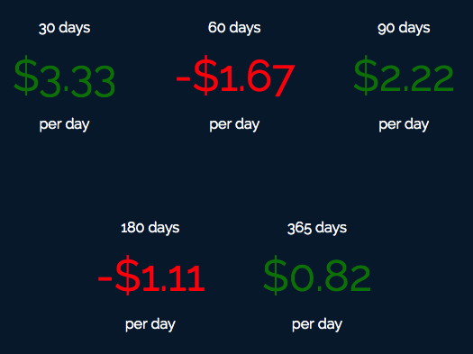

[Check out the live version here.](https://hoff.tech/cashflow/)

Cashflow is a teeny tiny tool that I built to give me an interesting view of my finances.

After uploading a your transaction history, cashflow will tell you how much your net worth has changed **per day** in the past 30, 60, 90, 180, and 365 days.

It's a bit of a "snapshot" way of looking at it, but I still find it pretty interesting.

Cashflow is built with [React](https://facebook.github.io/react/), [Pug](https://pugjs.org/), [Stylus](http://stylus-lang.com/), and [Webpack](https://webpack.github.io/). It's hosted on [GitHub Pages](https://pages.github.com/), and continuously integrated and deployed using [CircleCI](http://circleci.com/) and [spooooky dark magic](https://github.com/kenhoff/cashflow/blob/master/deploy.sh)!
