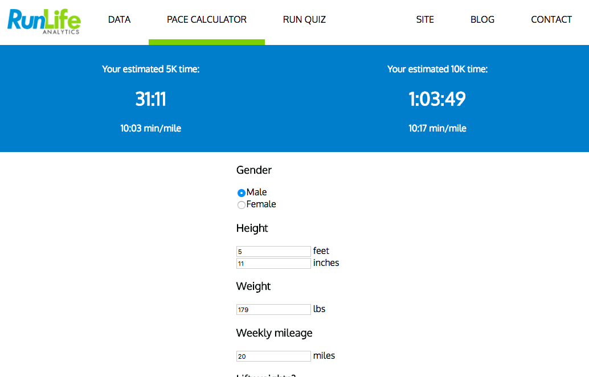
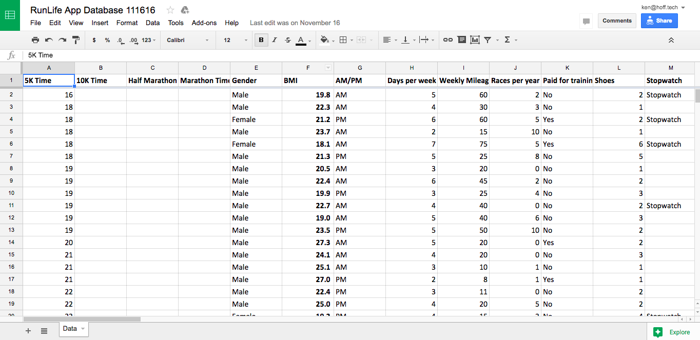

[Check out the live app here!](http://app.runlife.run/) You can play with a graph that shows all of the runner data, get an estimated 5K and 10K time, and get some data-driven recommendations on how to hit your goal time.

> I didn’t know if I was ready to pull the trigger on hiring a developer, but I’m so glad I did. Ken knows his stuff. Not only does he have more technical chops than I could have ever used, but he is also creative, experienced, insightful, and pleasant! His understanding of people, projects, business, and startup didn’t just help him get the job done, it helped me feel both comfortable and excited about working with him. Ken is not just performing a service, he’s working with you, applying expertise, creativity, and insight. In addition to his development work, he acted as an adviser, engaging in frequent discussions about business model, user testing, product development, and lean startup technique. This comprehensive perspective on how the technology fits into the ecosystem the team is trying to create provides value way above and beyond the scope of the contract.
>
> I guess this is why everyone who’s worked with Ken has tried to hire him! His ability to create value is the perfect match for the teams he works with. Unfortunately for RunLife, he loves his current role. Which makes sense--doing projects for different companies and startups lets him play such an important role in identifying those first steps into technology and helping to shape their early concepts of product.
>
> Working with Ken, I not only got an amazingly functional product, but I also came away wth a better understanding of my business. I’d work with Ken again in a heartbeat—and hopefully will again soon. I’d recommend him to anyone in startup who needs help breathing the first breaths of life into their product and company.
>
> \- Dave Courage, CEO of RunLife Analytics

# Origin story

I met David Courage and Jip Hubbard at the [CUNVC](http://www.colorado.edu/nvc/) (University of Colorado New Venture Challenge) Quick Pitch Night, where entrepreneurs get 60 seconds to pitch their idea/company to mentors, hoping to attract advisors and team members.

David and Jip met at my office in [Spark Boulder](http://www.sparkboulder.com/), where we talked about the kinds of things that they'd love to see in a prototype - something that could help them show runners how beneficial all of their data could be, as well as showing potential investors what a full platform could look like.

This was a quintessential MVP package - we started work on November 1st, and wrapped up work on November 16th with a fully-functional app and a lot of high-fives all around :)

# Getting started

David, a pretty hardcore runner, had been collecting a tremendous amount of runner data. He had over 50 features from 100 different runners - information about their 5K time, age, height, weight, BMI, whether they ran in the morning or evening, how many calories they eat every day, how many pairs of running shoes they have, what fitness trackers they have, if they're in a stable relationship, if they have a dog, and much more.

David had been working to try to get real, concrete results from this data, results that could help real runners. He found some pretty awesome ones - men who eat breakfast, on average, run up to a minute faster than those who don't. Women who own 6 pairs of running shoes ran, on average, three minutes faster than those who only owned 1 pair of running shoes.

(Okay okay, I know, correlation, not causation)

It was some pretty cool stuff - David was using legit machine learning techniques (regression algorithms) to evaluate his data and try to predict run times based on the data that he already had.

(If you're interested in learning some machine learning techniques, like regression and classification algorithms, then I'd recommend checking out the [Stanford Machine learning course taught through Coursera](https://www.coursera.org/learn/machine-learning). As a developer, you should really start learning this stuff - more and more software is starting to integrate machine learning in one form or another, and it's important to know the concepts.)

David originally collected all of his survey responses through a third-party form, but had manually cleaned up all of the data points (all 100 of them, each with 50 features!) and compiled them into a spreadsheet.

The fact that we already had all the data in spreadsheet format was pretty great. I could just download the spreadsheet in CSV format, and then write a tiny little script that converted all of their data into a JSON object array, which was a lot easier to work with.

# Iteration

One of the things that made RunLife such a _fantastic_ client to work with was really buying into the whole MVP package process. They gave me a lot of creative freedom - they came into the work session with a vague idea of the product that they'd like to get out of it, but they were also totally and completely open to having me bring my full product skills to bear, to build a product that really answered all of their questions and showed how powerful their concept could be.

They wanted to get some kind of proof-of-concept product that they could show to runners and VCs. Not necessarily totally functional, and a little rough around the edges, but something that they could at least point to and say "that, that's what we're trying to accomplish here". Because of that, we were able to move really quickly - with a first version of the app up in the first couple of days, we were able to focus on other features and components of the app, like the Pace Calculator and the Run Quiz, features that were easy to build once we had the initial framework up, and also showed off the direction that they were taking RunLife.

# Storing the data in Google Sheets

One of the requirements that emerged for this app was to be able to plug in new data farther down the road. David and Jip were interested in hosting a race in a few months, and they were going to get survey data for potentially hundreds of new runners. They wanted to be able to punch that new data into the system without having to hire on a developer again.

In any other project, I'd say "okay, so this is going to require an authentication system, and validation of user input, and user-defined schema for the data" and on and on. But we only had two weeks, and there was plenty of other features that required our attention during that time.

I decided to use the existing Google Sheet with all of the data as the real-time data source for the app. Usually, I was just downloading the CSV version of the sheet, putting that into the source code, and bundling that with the application when deploying.

However, if David and Jip put new runner information into the Google Sheet, I wanted it to show up right away inside the application. This means using the Google Sheets API (and Google APIs in general) to make a client-side call, as soon as the application loads in the browser, to get all of the latest data from the Google Sheet.

This worked **wonderfully**. It's simple, fast, and lets David and Jip dump a bunch of preformatted data into the application without much overhead. I don't have to build any kind of authentication or data validation or schema management systems, and they get to use an interface that they're already familiar with and have been using since day one.

# Tech stack

The frontend is written in [React](https://facebook.github.io/react/). It uses [React Router](https://github.com/ReactTraining/react-router) to handle client-side routing, along with [Stylus](http://stylus-lang.com/) to generate the CSS, and [Pug](https://pugjs.org/) to generate the one HTML file that exists.

The backend is written in [Node.js](https://nodejs.org/en/), and uses the [Express](http://expressjs.com/) framework to handle API calls, as well as sending all of the static assets (`index.html`, `style.css`, and `app.js`). We use [Google's official Node.js library for using Google APIs](https://www.npmjs.com/package/googleapis) in order to make requests to the Google Sheet that contains all of our runner data, and then serve that over an Express route. There's a dedicated Google service worker account that authenticates our request to Google Sheets.

RunLife Analytics uses [GitHub](https://github.com/) for version control, and is continuously built, deployed and hosted on [Heroku](https://heroku.com/).

