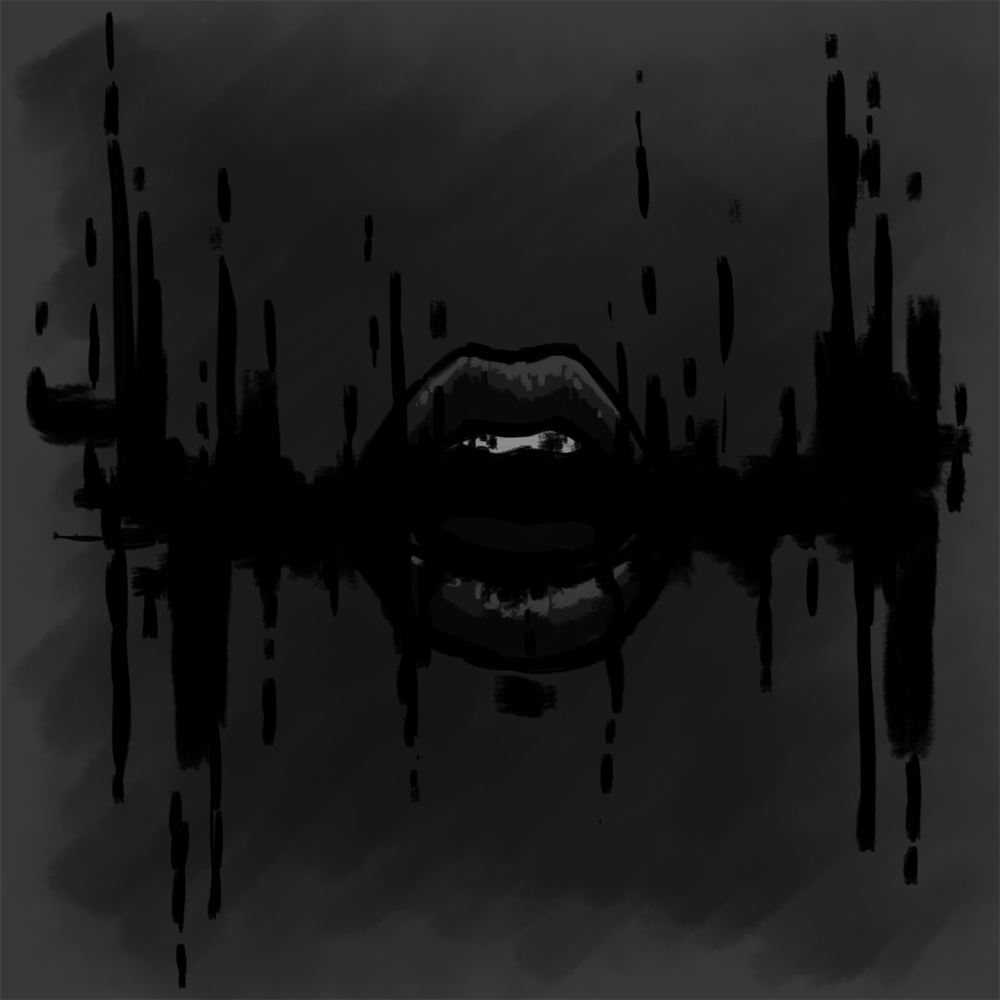
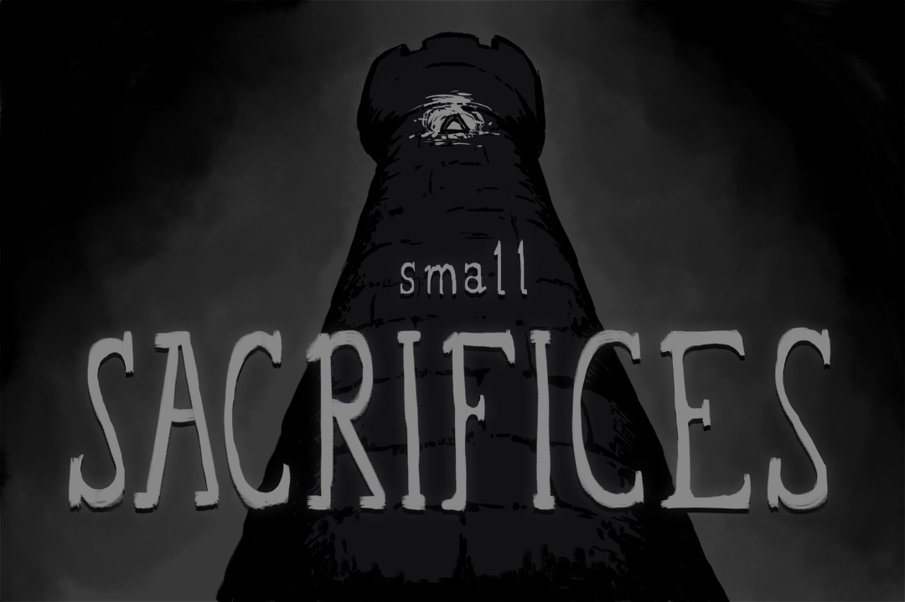

<iframe src='https://www.youtube.com/embed//TjwlBhRgW6c' frameborder='0' allowfullscreen></iframe>

In January 2016, I had just moved back to Colorado, and I was looking to participate in the Global Game Jam again!

The Global Game Jam is a worldwide game jam, where hundreds of sites around the world host real-world meetups for teams to get together and make games in 48 hours.

I reconnected with my artiste extraordinaire friend [Kacy](http://kacycorlett.com/) (who also did art for [It Lives](/projects/it-lives) and [The Facility](/projects/the-facility)) and my audio savant friend [Joshua Du Chene](https://soundcloud.com/joshuaduchene) (who also did audio for [It Lives](/projects/it-lives), [Bananacat's Violence](/projects/violence), and [Bananacat's Maniac Mystery Mansion](/projects/maniac-mystery-mansion)), who I think was tripping across Colombia at the time, but somehow he still made time for it!

I had been writing a bunch of Slack bots lately, so I thought it would be fun to make a text-based adventure game based on Slack. I could post art inside the Slack channels, and have users open up a separate browser page that could play audio, as well as sound effects (using websockets). My buddy [Dane](https://www.larsendt.com/) helped by writing a quick procedurally-generated room/level generation algorithm prior to the jam.

The theme of the jam was **Ritual**. The gameplay we settled on was extremely simple - put the player in a maze, and have them collect `n` items and assemble the items in a certain order to move to the next level, where they'd have to collect and assemble `n+1` items. I originally had some awful cookie-cutter fantasy plot with dungeons and orcs and stuff, but then Kacy took it in a far better direction with the dream-eating hazy-reality ambience.

There was one moment in this jam that I don't think that I'll ever forget. It was Saturday night, about halfway through the jam - I had gotten most of the code done that day, and Kacy had a bunch of the art already done and sent over to Josh for reference material when creating the audio. Josh (still in Colombia!) was going to hammer out a first version of the ambient music/soundscape that would play while the player was navigating through the maze.

I try to encourage everybody on the team to take as many creative liberties as possible with whatever they create. I generally only have technical and game design requirements - I wanted overall music/soundscape grow in intensity, somehow - we had 5 levels, and wanted to give the player some audio progress cues.

I showed up on Sunday morning bright and early, and got a chance to listen to the first version of the music/soundscape that Josh had created, based on Kacy's artwork.

It was incredible. Just...unbelievable. I have no words to describe how perfectly it fit the ambience of the game, how it fit the gameplay, the artwork, the story, the whole aesthetic. Josh and Kacy are truly _masters_ of their craft. I am astoundingly lucky to be working with these two amazing creatives!

Check out Kacy's [full art for the game here](http://kacycorlett.com/post/138903540095/art-assets-made-for-small-sacrifices-a), and check out Josh's soundscapes for the game [here](https://soundcloud.com/joshuaduchene/small-sacrifices), [here](https://soundcloud.com/joshuaduchene/from-the-top-of-the-tower), and [here](https://soundcloud.com/joshuaduchene/small-sacrifices-sound-design-sampler). **Headphones and a quiet space obviously required!** Also, check out the [gameplay video](https://youtu.be/TjwlBhRgW6c)!

