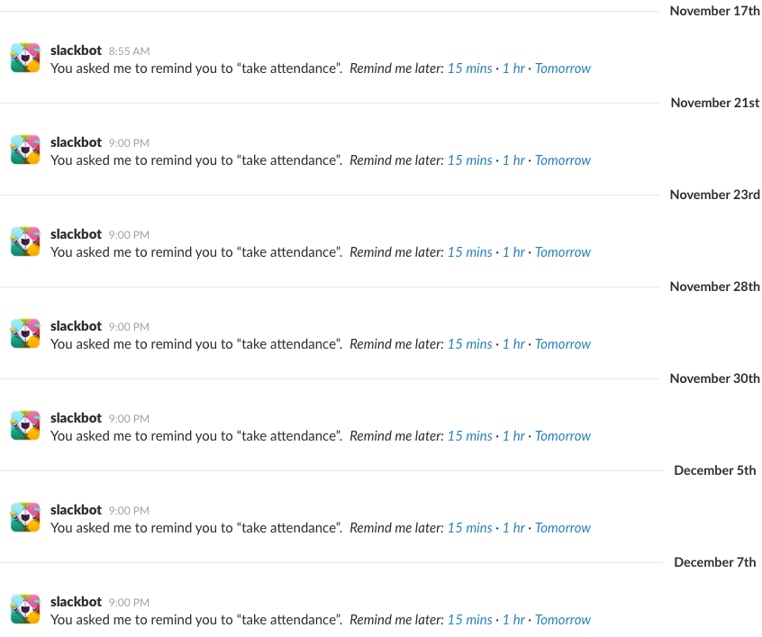

Hey here we go again! Spark Boulder decided to have me back again to teach the Fall 2016 semester of their Front End Web Development class. At this point, I'm really getting the curriculum dialed in - we had 6 students in the class, and, as always, it was an absolute ton of fun.

* * *

# Things that went well

## The caliber of this class

This semester's cohort was _good_. All of them were experienced, motivated, and quick learners.

Generally, whenever I teach each one of these sessions, I am absolutely _stoked_ if we spend only half the time going through the actual lecture content of the class. If the students are asking questions, then that's a good sign! It's not necessarily that they're not understanding the content - it's usually that they want to dive deeper on specific content that I didn't cover in the slides.

I didn't get many questions over the course of these sessions. It just didn't happen. (However, when I did get questions, we got _really_ into it.) I guess all of the students were just feeling good enough about the content that they didn't really have any questions? (Or, they were feeling so confused that they didn't even know what to have questions on - but I have regular checks and balances against that.)

There were frequent sessions that I'd get all the way through the content for the class waaaaaay before we intended to end. Guess I need to rework some of these sessions!

* * *

## Moving more stuff onto classbot.hoff.tech

Back on the original version of @classbot, all of the assignment and reading info was accessed from the @classbot Slack bot, not from any kind of site or slides anywhere.

But that's all changed now! All of the reading and assignment information has been moved onto <https://classbot.hoff.tech/>.

Students still have to submit assignments on the @classbot Slack bot, though. Maybe that'll change next time?

* * *

## Attendance

See, I had this problem [last time](/posts/2016/08/22/spark-class-summer-2016-postmortem#attendance) where I sometimes forgot to take attendance.

I could have solved this problem in the most epic developer way possible - every class session, @classbot could message each individual student, and only accept a certain code word (that was provided during the class session) to validate that the student was there every single session. However, we'd have to come up with some way to prevent student cheating...students could message other, absent students what the secret keys were! So that would be a pretty fun system to make.

Or, you know, I could just tell Slack to remind me to "take attendance". That works too, and is just as (probably more) efficient than trying to write a bunch of software to do it for me.

The judo solution is frequently the least technical solution, right?

* * *

## site44

Goodness gracious, I am happy that I found [site44](http://www.site44.com/).

See, in order to submit assignments to @classbot, your site must be accessible from "The Internet". This usually involves deploying your site to some kind of hosting service out there - [Firebase](https://firebase.google.com/) had a free option, so I originally taught students to use that.

This was a little difficult for students - they had to learn the command line (which involved [getting bash running on windows](https://git-for-windows.github.io/), if you didn't have a mac), which also involved understanding the file system. Then they had to successfully navigate to the project folder, initialize the project on Firebase, deploy the static files to Firebase, and redeploy every time they wanted to change something.

If you're an experienced dev, this is pretty straightforward. (This is using tools and paradigms that we've been working with our entire career.) However, if you're a student who has _literally_ just started writing code _this week_, it's pretty intimidating and difficult.

Enter [site44](http://www.site44.com/). It's what it says on the box - it takes a site in a Dropbox folder and automatically deploys it onto the internet. It is disgustingly easy - so easy, in fact, that I was able to literally cram in an **extra 90 minutes** of lecture time. **Algebraic!**

* * *

# Things that could have went better

## stupid, stupid @classbot

Sweet, simple @classbot. It tries so hard.

(If you're not sure what @classbot is, check out my [other](/posts/2016/08/22/spark-class-summer-2016-postmortem) [postmortems](/posts/2016/06/26/spark-class-spring-2016-postmortem).)

[There's](https://github.com/kenhoff/classbot/blob/master/assignments/tests/hello_world.js) [a](https://github.com/kenhoff/classbot/blob/master/assignments/tests/is_this_person_old.js) [couple](https://github.com/kenhoff/classbot/blob/master/assignments/tests/jquery_get_request.js) [assignments](https://github.com/kenhoff/classbot/blob/master/assignments/tests/say_hello.js) where students need to [write](https://github.com/kenhoff/classbot/blob/master/assignments/tests/jquery_post_request.js) [some](https://github.com/kenhoff/classbot/blob/master/assignments/tests/jquery_get_paragraph_tags.js) [JavaScript](https://github.com/kenhoff/classbot/blob/master/assignments/tests/create_hello_string.js) [functions](https://github.com/kenhoff/classbot/blob/master/assignments/tests/count_to_100.js).

I've never really had any trouble with this before. I write a couple checks to ensure that the function actually exists before I try to call it, and that it's returning stuff in the right format.

This year, @classbot started hiccuping. There were **always** edge cases that I forgot to check - even after I started wrapping all the function calls in a `try/catch` block, I'd still get errors.

Usually, a student would be working on an assignment, would try to submit an assignment, and @classbot would crash, taking a couple minutes to reboot. The student would message me, and I would frantically get debugging, because that tight feedback loop is extremely important to the students' learning.

This stresses the critical importance of tests for code that runs in production. I don't have tests for @classbot (the original version was written in an afternoon), and that's bad. What I really should be doing is testing every assignment with an array of possible submissions for that assignment. If a student comes to me with a submission that crashes @classbot, then I should add that specific file to the tests, and ensure that @classbot doesn't crash on that submission.

I want to clarify that all of this is entirely my fault, and not the students' fault in any way, whatsoever. My job (as both an instructor and a developer) is to write software that is rock-solid and performs all of the desired tasks, and I feel like I've really dropped the ball on that.

* * *

## Modulus

Typically, during the class, I teach the students to use [Modulus](https://modulus.io/) for our "Advanced Topics: Server-side Programming with Node.js" session.

Modulus is great! It's a lot like deploying to Firebase. It's got a $15 free credit (more than enough for our class) with no payment information required, and it even lets you sign up through the command line!

Only problem is, this semester, we didn't learn the command line. (We switched from [Firebase](https://firebase.google.com/) to [site44](http://www.site44.com/), which meant we didn't need to learn the command line.) So, in a _single_ advanced topics session, we had to learn how to open a terminal (or go through the git bash process, if you're on windows), how to navigate through the file structure, initialize a Modulus project, deploy a Modulus project, **and** learn _all_ of the stuff that they need to know about Node.js. Wasn't really a great situation.

Next time, I think we're going to use [Gomix](https://gomix.com/). It's basically like the site44 version for full-stack apps, and is completely free. It doesn't give the students the experience of what it's like to deploy a full-stack app in real-life, but this is just for a single session, and I think I'm willing to make that tradeoff.

(Like many startups, both companies have recently gone through/are about to go through a "rebranding", which is usually code for "the designers got bored and needed something to do". Gomix used to be called Hyperdev, and I think that Modulus is about to rebrand to Xervo or something like that. Just a heads up in case the above links point to something confusing.)

* * *

## Class in the evenings

Funny how things change! [Last time I wrote about](/posts/2016/08/22/spark-class-summer-2016-postmortem#front-end-web-dev-_nights_) how we were moving to a later time slot for the class.

It was a good experiment, but it didn't really work for me. Usually I'd have students stick around a little after the class to ask questions (which is great!) but that usually means that I don't get home til about 10pm, and I'm already exhausted from doing all the other work from the rest of the day, so I don't end up going to the gym `:C` &lt;-- mega sad face. And it was always too late to go out to drinks after class!

I think we're going to move it back to a 6pm-7:30pm timeslot next semester. I guess cranky old man Ken just needs an earlier bedtime.

* * *

# Closing thoughts

Oh yeah, rebranding! I'm thinking of changing the title of the course from "Front End Web Development" to "Frontend Web Development". I want to de-emphasize the "Front" part of it, just because with so much of web development nowadays it's necessary to understand the full stack. I should also probably try to find some new Adventure Time gifs.

Hopefully this has given you a pretty good idea of how the class has evolved over time. If you're thinking of maybe taking the class, get in touch! Feel free to shoot me an email (about anything) at <mailto:ken@hoff.tech>, and get more info over at [Spark Boulder](http://www.sparkboulder.com/).

Excelsior! 🚀
