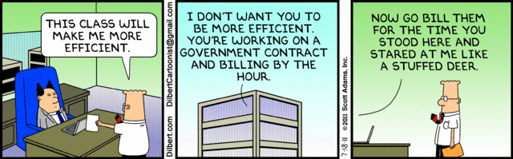

You may have recently read about [how much it cost](https://kev.inburke.com/kevin/tsa-randomizer-app-cost-336000/) to develop the TSA's new randomizer app!

Here's the app in action:

<style>.embed-container { position: relative; padding-bottom: 56.25%; height: 0; overflow: hidden; max-width: 100%; } .embed-container iframe, .embed-container object, .embed-container embed { position: absolute; top: 0; left: 0; width: 100%; height: 100%; }</style><div class='embed-container'><iframe src="https://www.youtube-nocookie.com/embed/P_KmFJ2gGzw?rel=0&amp;controls=0&amp;showinfo=0" frameborder='0' allowfullscreen></iframe></div>

My goodness, that seems like a pretty simple app! I could probably build it, in like, an hour?

So I did. [Here it is.](https://tsa-randomizer.hoff.tech/)

This is the entirety of the JavaScript:

```javascript
$(".randomizeButton").click(function() {
	$(".arrows > *").addClass("invisible").removeClass("leftArrowAnimate rightArrowAnimate")
	if (Math.random() >= 0.5) {
		$(".leftArrow").clone().removeClass("invisible").insertAfter(".leftArrow");
		$(".leftArrow:first").remove();
	} else {
		$(".rightArrow").clone().removeClass("invisible").insertAfter(".rightArrow");
		$(".rightArrow:first").remove();
	}
})
```

I could have done it without jQuery, but that's more expensive, and we were really trying to fit within the budget here.

(there's a little more HTML and CSS, but I won't bore you with that)


