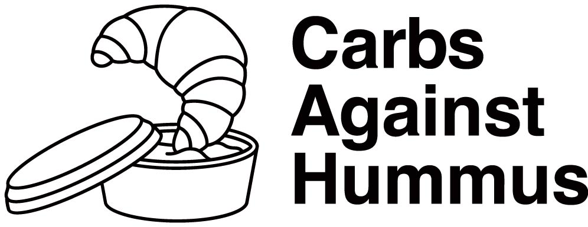
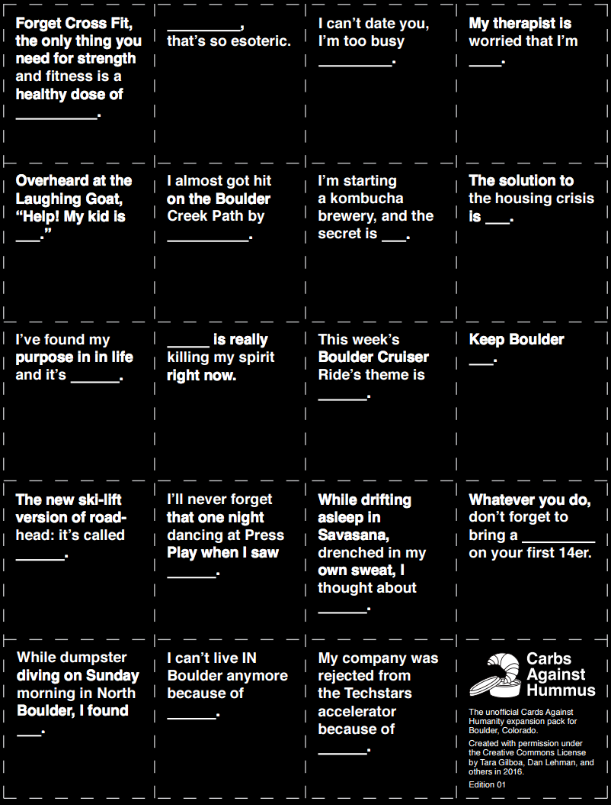

Carbs Against Hummus is an unofficial Boulder-themed expansion pack for [Cards Against Humanity](https://www.cardsagainsthumanity.com/)!

You can check out the project and download all the cards over at <http://carbsagainsthummus.site44.com/>. (We'll attach the official domain name up there soon.)

I just built the site. All of the cards were thought up by the exceedingly talented [Tara Gilboa](https://twitter.com/tigilboa) and [Dan Lehman](http://danlehman.com/)!

## 25 square miles surrounded by reality

[Tara Gilboa](https://twitter.com/tigilboa) was actually one of my students in the first [Spark Boulder Front End Web Development class](http://www.sparkboulder.com/sparkclasses)! (I also [wrote a postmortem on that class](/stuff/2016/06/26/spark-class-spring-2016-postmortem), and I'm still teaching it, so [go sign up!](http://www.sparkboulder.com/sparkclasses)) We ran into each other at a recent Startup Weekend, and she told me about this "Boulder expansion pack for Cards Against Humanity" that she was working on.

Tara (along with Dan, the designer on the project) were looking to get a nice landing/marketing site done for Carbs Against Hummus. They wanted something done before the holidays, so that they could send it around to their friends and family - just something where people could download the card pack, and follow them on social media.

There wasn't really any budget here - they didn't want to charge for it (as per CAH's Creative Commons license), and the donations would just go straight to charity. However, because it's an entertaining project (and can benefit charities), I usually set up a "Pizza and Beer" option for these sort of things. Here's the exchange - you buy pizza and beer for the evening, and I provide the web development skills.

We're still working on this: next time, we're thinking that it'd be awesome to have a community-created version. Users could submit cards, visitors could anonymously vote on which cards they thought were the best, and the best cards would make it into the second edition of Carbs Against Hummus. We'd also like to add an optional donation to local Boulder charities. Neat!

## Tech stack

Carbs Against Hummus is hosted on the disgustingly-easy-to-use [site44](http://www.site44.com/) platform.

The actual HTML of the site is built using [Pug](https://pugjs.org/), and the CSS is built using [Stylus](http://stylus-lang.com/). In the development environment, auto-rebuilding is accomplished using [Nodemon](https://nodemon.io/) and continuously rerunning `build.sh` (a.k.a. less of a [swiss](https://webpack.github.io/) [army](http://gulpjs.com/) [knife](http://gruntjs.com/), more of a [rock](https://en.wikipedia.org/wiki/Make_(software)) tied to  [stick](https://www.keithcirkel.co.uk/how-to-use-npm-as-a-build-tool/)).

Check out all the [source code for Carbs Against Hummus on GitHub](https://github.com/kenhoff/carbsagainsthummus).

