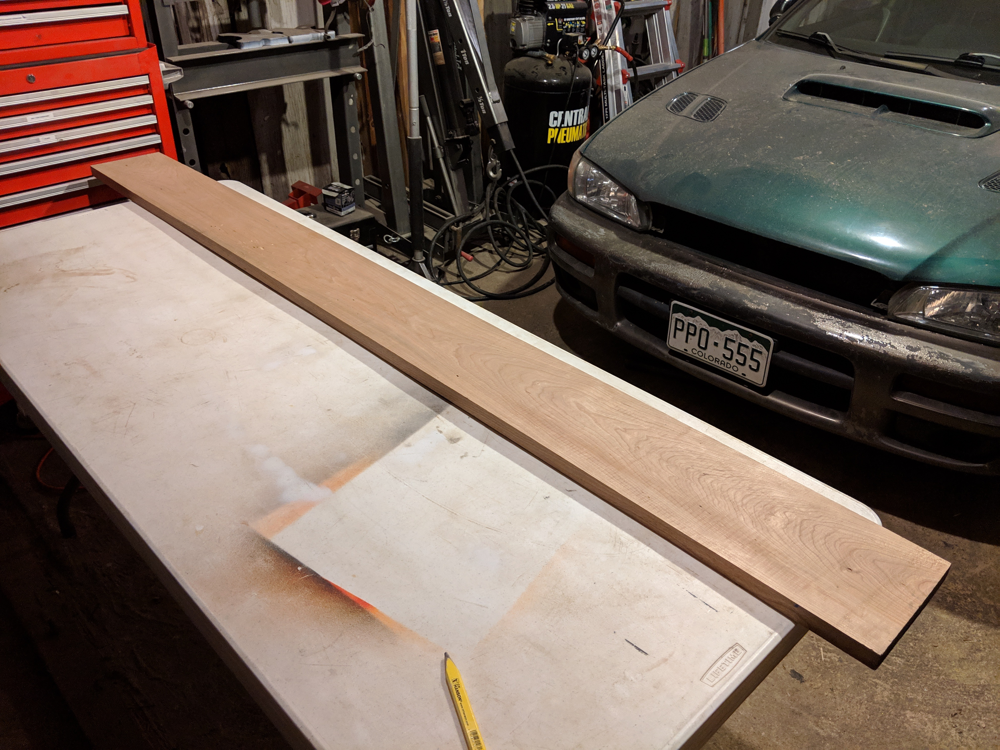
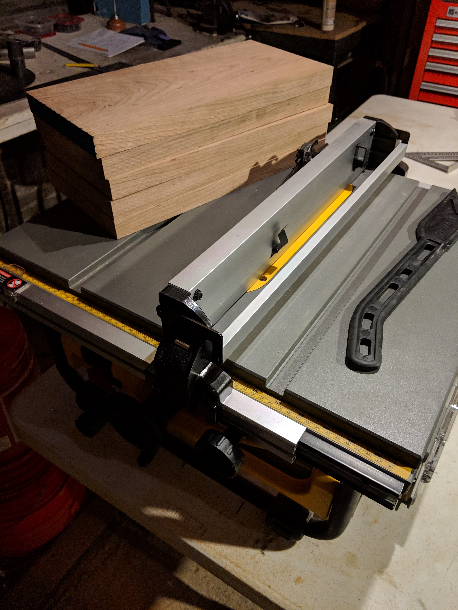
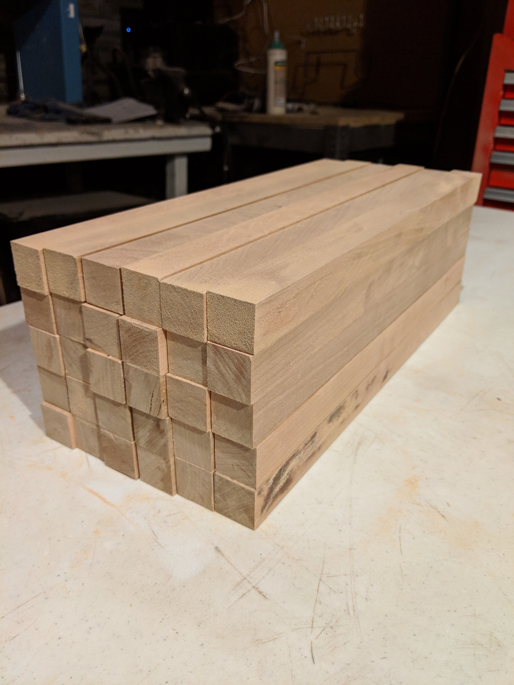
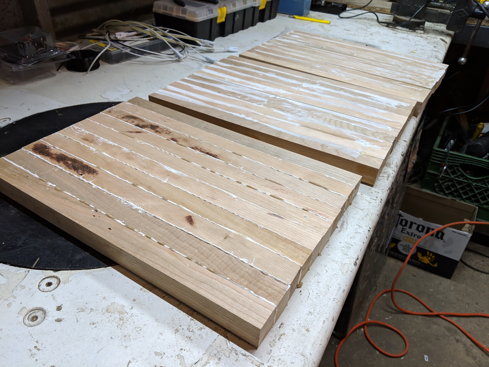
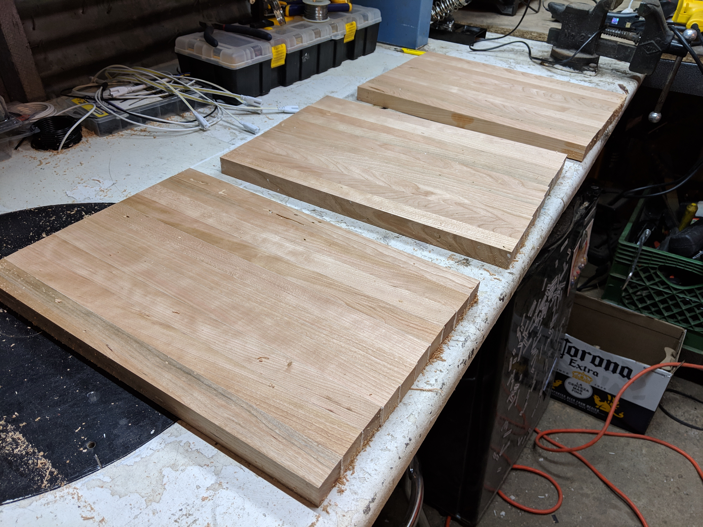
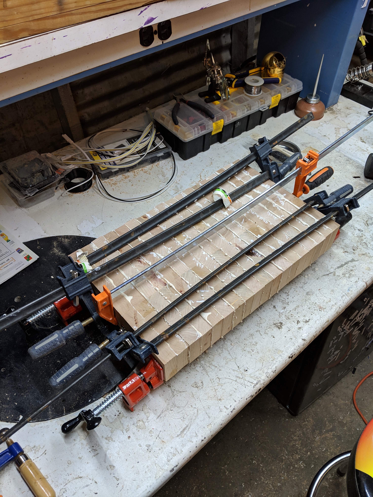
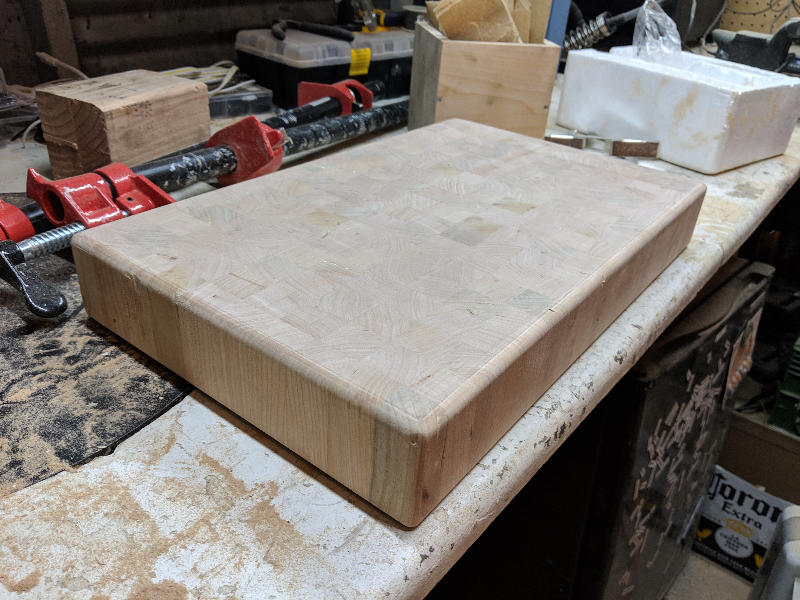
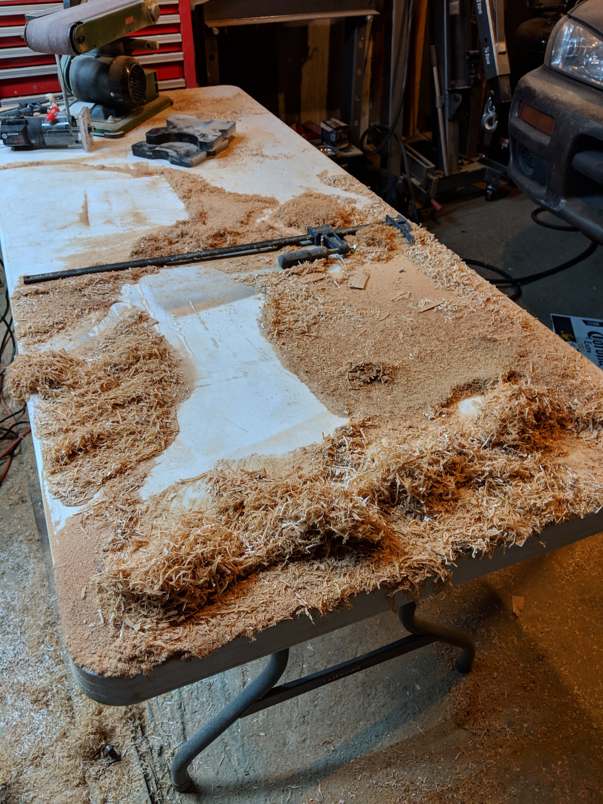

# End-grain butcher block cutting board

Hey! I made a cutting board! Check it out!

It's not just any cutting board. It's made of cherry (the wood, not the berry that comes from the tree), it's about 2.5" thick, and about 12" wide by 18" long.

My brother has been getting pretty into cooking lately, and I've been feeling more comfortable (but not too comfortable) with my shiny new table saw, so I figured I'd surprise him with a fancy cutting board for the holidays.

_(this also means that he cooks for me more, so it's really a win-win situation)_

## Step 1: Acquire wood

Head on down to your local hardwood store (in my case, [Frank Paxton Lumber Company in Denver](http://paxtonwood.com/denver/)). Make sure to poke around for a little bit, and realize that you really probably should have brought the truck to move all this wood. Also, make sure to completely misunderstand the concept of a [board-foot of lumber](https://en.wikipedia.org/wiki/Board_foot), so that you start pulling multiple $50 boards off the shelves before realizing that you really only need just one. Then, lose your wallet (briefly) in the parking lot and lie to your brother about where you were all morning.

## Step 2: Size up your wood, and chop that wood into tiny pieces

First you gotta measure up your board (length, width, and thickness) to get a rough idea of how big your finished product is going to be, in volume. Also keep in mind any restrictions you have on tools - my brother was letting me borrow his thickness planer for a little bit, and I knew that had a maximum width of 12", so I couldn't make the board any wider than that.

Lastly, try to keep in mind that you want to respect some proportionality to your cutting board. Yeah, I _could_ have made a 3" thick board, but that's really pushing the limit of how thick a board can be before it starts to look a little...weird. Funky. Disproportional. Etc.

I didn't want to rip (_rip: cut a board length-wise, along the grain_) the board I had down the entire length, because I knew I would have to glue all the pieces together, so I cross-cut (_cross-cut: cut a board across the grain, usually perpendicular to the width?_) the board into equal smaller boards first.

## Step 3: chop that wood into tinier pieces

Rip the board along the grain, so you've got lots of tiny square strips of wood! Make sure that you move just a little too slowly on some of the pieces, so that you get burning from the table saw. Also, completly forget to chop off the little painted section on the end of the board, so you have to go back and sand it off later.

## Get gluing

This is where it gets a little tricky. Figure out the width of the cutting board, then bust out your  [Type-3 wood glue](https://www.homedepot.com/p/Titebond-III-16-oz-Ultimate-Wood-Glue-1414/100522343) (because it's rated for food contact) and an unreasonable number of clamps, and get to work.

(clamps not shown above. but trust me, there were a lot of them.)

Keep in mind that it's likely that none of these are going to be straight, level, flat, or have flat edges at all. But we'll fix that next.

## Power tools

Just take out your handy conveniently available 12-inch portable thickness planer and run the boards through!

But seriously, this is where having power tools tends to come in handy, and I would consider actually pretty necessary for this part. I was stupid lucky to have my brother's thickness planer available. It's a stupid, expensive, heavy, messy, and loud piece of equipment, and it probably made this entire project 10x easier.

The key thing is - for these glued-up boards, it's absolutely _critical_ to get them as flat and uniformly thick as possible. Sanding them perfectly smooth isn't enough - I actually tried this with a teeny tiny prototype of the cutting board beforehand, and discovered that it's pretty much guaranteed that these glued-up boards have some amount of warp in the board from side to side. In the next step, I'll cross-cut them into strips of 2.5" glued strips and glue those strips together, which means that if there's any distortion in the shape of those strips, it'll telegraph across the entire board and make gluing the board together more difficult.

It's _possible_ to get the boards perfectly flat, if not uniformly thick, with a manual bench hand planer. As long as the boards are flat, you'll be fine - it's not necessary to have these boards be a uniform thickness, but the finished product might look a little better if there's minimal variation in the the widths of the sections.

## More chopping, and more clamping

Before you start, cross-cut the edges of the finished boards so that the ends are perfectly flat and square to the long edges.

I'm missing a photo of the chopped up small sections, but I've got some photos of what the final glue-up looks like.

Loads of glue. Loads of clamps. Nothing lines up perfectly, but that's okay! It's my first one of these, and it's for a family member. Imperfections are perfectly acceptable here.

The next thing that happens on the board is to plane it again, just to get all the excess glue and any height disparities sorted out. However, this is where we have a fundamental problem with using a thickness planer on the cutting board - chipout.

When the board goes through the planer, the blades of the planer cut down the top surface of the board. When the planer reaches the end of the board, the force of the blades on the board tend to "chip out" the wood at the very end of the board, leaving some nasty gouges on the edges of the cutting board :C

(there's a couple ways to mitigate this, usually by using some sacrificial strips around the edge of the cutting board, but I decided that it was just something that I'd clean up later.)

Next, I went ahead and cut all the edges of the board perfectly straight and square with my table saw. (Yeah, it was a little dicey trying to trim up that big of a board with a table saw. I took all the appropriate precautions with anti-kickback devices and blade guards. A nice fat jointer is next on the tool wish list.)

_(You can see some teeny tiny lines all the way down the edge of the board, where one of the thickness planer blades has a bit of a chip.)_

## Trim router!

I got a trim router! It is fun, and rather difficult to use, but the results were pretty good. I just put a 1/4" roundover on all the edges of the board, including the vertical edges, then went through afterwards and cleaned up burn marks and edges with 80 grit sandpaper.

Last thing to do in the garage was sanding - I don't have an orbital sander, so I just did a quick hand sanding with 80, 120, 180, and 220 grit sandpaper. It was already pretty smooth from planing, but it didn't hurt to scrub it down just a little bit more.

Then, I brought the board inside to give it a couple (many) coats of mineral oil. Apparently it's pretty important to use food-safe and non-organic oils for cutting boards - using varnishes or waxes risks of the food getting contaminated, and flaxseed/vegetable/canola oils tend to decompose and go rancid D:

## Take product photos — give to recipient

TJ was pretty stoked with it :) It came out really well. Once the mineral oil goes on, it brings out the grain and deepens the color in a really wonderful way.

CC was very interested in licking the mineral oil out of the board, and had to be locked away during the photo shoot.

## Clean up

Did I mention that the table saw and thickness planer produce a lot of sawdust?

