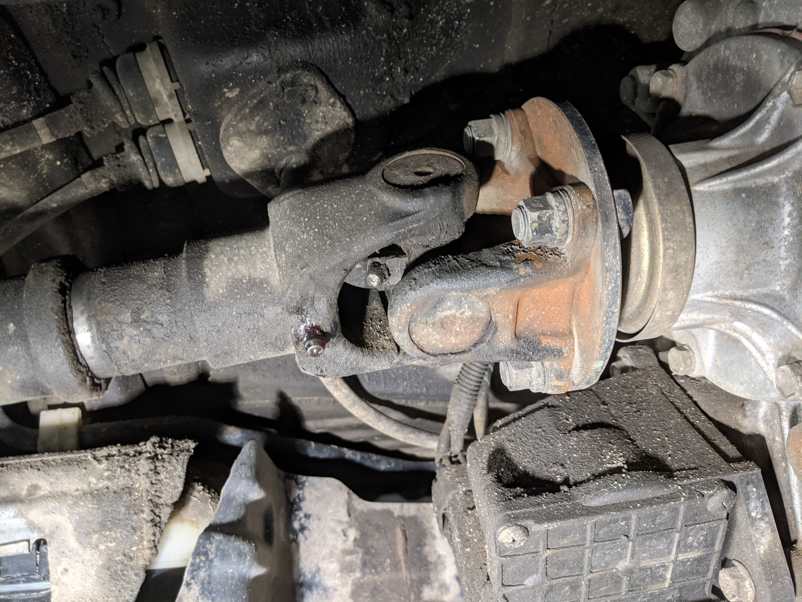
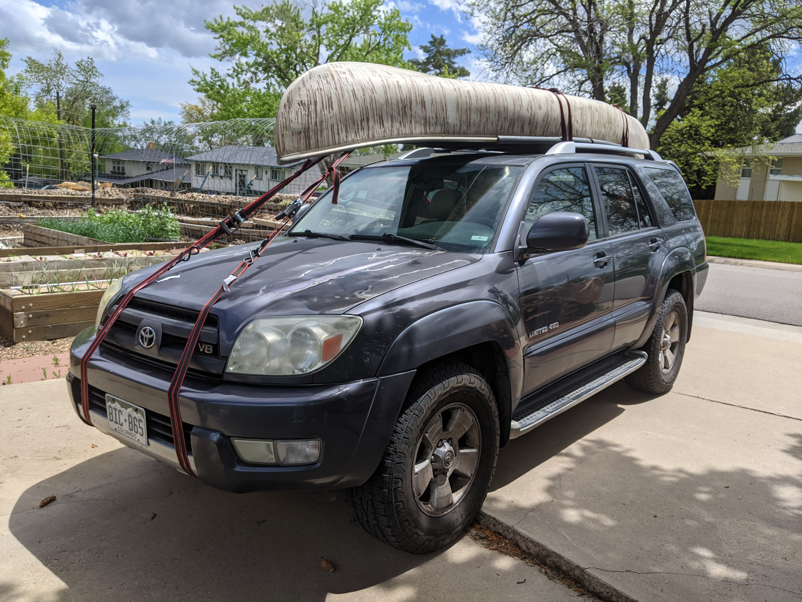

This is Fred!

Fred is a 2003 Toyota 4Runner Limited, with about 180,000 miles, and hopefully a whole lotta time left on the clock ;)

It has a 4.7L V8 engine, a 5-speed automatic transmission, full-time 4wd, a sunroof, heated seats, and a whole bunch of other fancy features. It's literally the nicest and newest (but not quite least-mileaged) car that I've ever bought!

I'd like to start chronicling the adventures and modifications that I make to this car - just like a "build thread" that you'd see on a forum. 

I'm pretty new to 4Runners. It's pretty great at a bunch of things (snow driving, carrying people and stuff, towing small-to-medium-sizedtrailers), and not so great at a bunch of things (gas mileage, throttle response, some wonky behavior when going down hills) but I've been loving it so far. 

The guy I bought it from used it to haul his drunk-ass sales buddies back and forth from ski slopes and golf courses for about 60,000 miles, and it's pretty apparent that regular maintenance was never very close to the top of the list.

## so what's wrong with it?

There's a pretty long list of things wrong with the car, but I haven't run into anything insurmountable just yet. Here's the large ones I've got so far:

**Airbag light is on.** I've pulled the codes and the diagnostic flowchart pages from the factory service manual. Best case, it's just a loose wire in a plug, or a specific cable that's faulty. Worst case, gotta replace the $600 SRS computer.

**4lo / center diff doesn't engage.** Trying to engage 4lo results in a pretty unpleasant grinding noise. I'm hoping this isn't a transfer case (read: expensive) problem. There's a [transfer case actuator](https://www.toyota-4runner.org/4th-gen-t4rs/156898-transfer-case-actuator.html) that apparently gets siezed up pretty regularly if it doesn't get used. (Surprise - previous owner literally never used it over the course of 60,000 miles.) I'm slightly concerned that it uses some nylon gearing - if those are stripped (and not just siezed) then that's a $600 part.

**Driveshaft clunk.** This one was actually easy to (already) solve - a little after I got the car, I started noticing some weird clunking noises every time the car started or came to a stop. Thankfully it was pretty straightforward - there's a couple (6) of "zerk" grease fittings on the front and rear driveshafts where the driveshafts need to get filled with grease. It's a messy job, but squishing enough grease in there to the point where it pushed out all the seals solved the problem right away.

**Leaky XREAS.** Another pretty common problem among this trucks is [the XREAS system](https://www.toyota-4runner.org/4th-gen-t4rs/54365-what-xreas-exactly.html) - it's a goofy cross-linked complex hydraulic shock absorber setup that tends to fall apart much sooner than traditional suspensions. Best bet is to remove it all, and replace it with a high-quality aftermarket setup.

**Brakes: warped, squeaky. Parking brake is squishy.** Little bit of a steering wheel shudder on braking, definitely feel a bit of a pulsating when coming to a stop. Parking brake is most likely fixed by adjusting the drum brake, and potentially replacing the pads. After a quick look at the front calipers, everything looks a little...mismatched. So we're just going to swap out all calipers, pads, rotors, shoes, and lines at the same time.

**Front wheel bearings.** There's a bit of a speed-dependent hum that pops up around 55 mph. It's not a critically urgent issue - but it's definitely not going to get better, and if I replace the wheel bearings without replacing the brake rotors, it'll just cause the wheel bearings to fail prematurely again. 

**Not sure when the timing belt was last replaced.** This is another big one. The [2UZ-FE](https://en.wikipedia.org/wiki/Toyota_UZ_engine#2UZ-FE) is an interference engine, with a timing belt, which means that if the timing belt snaps, the pistons and valves perform an unscheduled rapid disassembly. Generally the  timing belt should be changed every 60,000 miles - at 180,000 miles, it's definitely due. 

And a whole lot of other small things:

**Headlights: yellowed, foggy.** Pretty straightforward. There's aftermarket projector headlights, or the current ones can be retrofitted with projector housings and polished. Or, can upgrade to the '06-'09 model headlights, which are projector anyway!

**Front grille is loose.** Nothing a couple zipties can't fix, but the front grille also connects to the hood latch in a structural way, so might be worth taking another pass at that later.

**Several center console bulbs are burnt out.** Easy to replace with LEDs.

**Peeling paint on the hood / spoiler / wheels.** Obviously not something that affects the car functionally, but I've never done any kind of body / paint work on a car before - this might be a good chance to learn that! Or, just the plasti-dip stuff that all the youtube videos tell me to use.

**Rear emblem is missing.** The badges on the rear hatch are just fine - it's just the weird molded emblem on the rear. I haven't found a replacement part just yet - sooooooooo good excuse for me to 3d print a customized version!

**Rear window key cylinder isn't working.** Actually, may have already figured this one out - there's a third button on the remote that, when held, rolls down the rear window. If you put your key in the rear hatch, turn and hold, the rear window goes up, but I was having some trouble with that, until I realized that the key wouldn't go all the way in unless the car was unlocked. Problem solved!

**Head unit is jaaaaaanky.** It technically connects to my phone via bluetooth, but somehow never connects to the audio, unless I select a different audio source, then go back to bluetooth. I could spend [$1200 on a top of the line head unit](https://www.amazon.com/dp/B08GV15DDM/), or I could spend 1/10th of the price on a [glorified fancy android tablet](https://www.amazon.com/gp/product/B07VGR5Z4R) that will probably work more than 1/10th as well.

**Speakers appear to all be broken.** Somewhat related to the busted head unit, haha. They're not _all_ broken - as far as I can tell, the subwoofer works halfway, and the front center tweeter still works! That's about it though...

**Steering wheel is peeling.** This one drives me a little crazy. There's a spot at 12 o'clock that's pretty badly scuffed, and it seems like any kind of sanding is just going to cause more chunks to flake off. There's a [pretty popular youtube video](https://www.youtube.com/watch?v=sStxk4mv_DY) explaining how to re-stitch a leather steering wheel, or it's possible to do some kind of paracord wrap around it.

**Rear wiper intermittent control is...intermittent.** Mostly when it gets cold - switching the rear wiper to intermittent causes it to just make some unpleasant noises. Switching it to full-time fixes the issue, but it sounds like it could be a motor replacement. 

**Driver's side window clunks when rolled down.** Pretty minor, because I don't need to turn on the "outside AC" in such a fancy car ;)

## my goodness that's a lot wrong with it

It's not that bad! The car is still super drivable and reliabler. There's a handful of things that I would fix before taking it on a cross-country road trip or on super-rocky obstacles, but overall it's a great daily driver.

## What's next?

Fix all the stuff. So far, I've removed the backup camera, given it an oil change, and replaced the front and rear windshield wipers. I've greased the front and rear driveshafts to try to get rid of the clunking when the suspension unloads, but I may need to do that again, just to top it up. I've also given the totally cosmetic engine bay cover a thorough cleaning. So I'm off to a great start! 😅

I've already ordered a whole bunch of parts that need to go on as well. Wheel bearings, Bilstein 5100 shocks all the way around, new android head unit, front and rear dashcam + hardwire kit. I'll need to order brake parts, but that's going to be a little pricey, so I'm verifying that I have all the compatible parts under the car before I pull the trigger on those.

Oh - and go on some heckin' adventures! 

