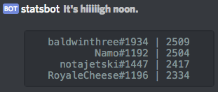

**It's hiiiiigh noon.**

Inspired by the [ultimate ability](https://www.youtube.com/watch?v=lMuFbPjRHLU) of Overwatch's favorite [shooty cowboy person](http://overwatch.gamepedia.com/McCree), I made a [Discord](https://discordapp.com/) bot that posts competitive ranks for you and all your Discord friends into your server every day at **hiiiiigh noon**. This way, you can have fun conversations with your friends about how _objectively terrible_ Adam is at Overwatch. **Zupah!** (loljk, we all know that support mains get shafted in competitive)

Here's what a sample post looks like:



## Add the Overwatch Statsbot to your Discord server

[You can add the Overwatch Statsbot to your discord server here.](https://hoff.tech/statsbot/)

To get started, just yell at it in a channel - something like:

```
@statsbot how do i get better at overwatch
```

It probably won't be able to help you with that, but it can help you start tracking some players!

## Implementation deets

The main question I usually get is: how does it work?

You see, if Blizzard had 100+ people working on Overwatch, then they probably would have exposed [some kind of Blizzard API](https://dev.battle.net/) so that players could pull down this information in some kind of sane way. But they have, like, two dozen people working on it. And they're all busy making new characters and maps and stuff. And probably "playtesting". So we have to figure out a different method.

Thankfully, all of this data is already exposed via [playoverwatch.com](https://playoverwatch.com/). Check out [my Overwatch career page](https://playoverwatch.com/en-us/career/pc/us/notajetski-1447) - it lists a ton of data, including eliminations, playtime, and most importantly, **competitive rank** (it's that ~2000ish number at the top there).

This means that we can use **web scraping** to pull down the data!

Legitimacy aside, web scraping (in an automated, headless way) can be stupid hard sometimes. In the age of single-page apps, pages usually require some obfuscated JavaScript calls to a backend in order to get data to display on the page. We'd first have to load the data into a headless browser, then make sure the JavaScript gets executed - this can be a lot harder than it sounds, but it's totally possible using [jsdom](https://github.com/tmpvar/jsdom) (muh fav) or [PhantomJS](http://phantomjs.org/).

Turns out that Blizzard builds the entirety of the page's HTML server-side, so no single-page app scraping hackery needs to happen here! ([You can see the full HTML for my career page here.](view-source:https://playoverwatch.com/en-us/career/pc/us/notajetski-1447)) We make a request to the career page, and the server puts together a bunch of HTML before sending it back out over the wire. Once we get the HTML, we can just parse it using [cheerio](https://github.com/cheeriojs/cheerio) (cheers luv) and pull out the competitive rank information that we need.

> Fun fact -  this is the way that all of the Overwatch stats sites get their data, including [Master Overwatch](http://masteroverwatch.com/)!

Overwatch Statsbot runs on my development server, hosted by [DigitalOcean](https://www.digitalocean.com/). [foreverjs](https://github.com/foreverjs/forever) generally handles any crashes (server reboots notwithstanding). Database is [Postgres](https://www.postgresql.org/), hosted by [Heroku](https://www.heroku.com/). Connection to Discord is handled by [discord.js](https://github.com/hydrabolt/discord.js/).

## What's this Overwatch thing you keep talking about?

If you're not totally sure what Overwatch is, [you should probably watch this](https://www.youtube.com/watch?v=IydZOlx2yrc).


