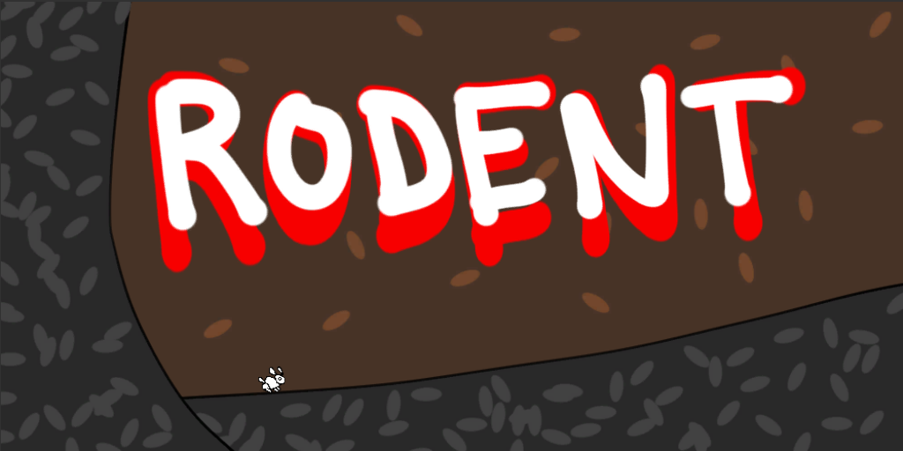

> That's the most foul, cruel, and bad-tempered rodent you ever set eyes on!
>
> ...
>
> Run away!!!

God this was a fun one.

**The jam?** [Ludum Dare 33.](http://ludumdare.com/compo/2015/08/19/welcome-to-ludum-dare-33/)

**The theme?** [_You are the monster._](https://twitter.com/ludumdare/status/634892760529682432)

**The inspiration?** [Monty Python and the Holy Grail.](https://www.youtube.com/watch?v=cCI18qAoKq4)

Placed 3rd for "Humor" of the 1198 games created during the compo (not including the jam games).

Check out the game on the [Ludum Dare site](http://ludumdare.com/compo/ludum-dare-33/?action=preview&uid=20246), and check out the [48 hour -> 5 minute timelapse here](https://www.youtube.com/watch?v=8n35-WSBM50). Also, the [source for the game is on GitHub](https://github.com/kenhoff/LD33).

[Play it here!](https://rodent.herokuapp.com/)

