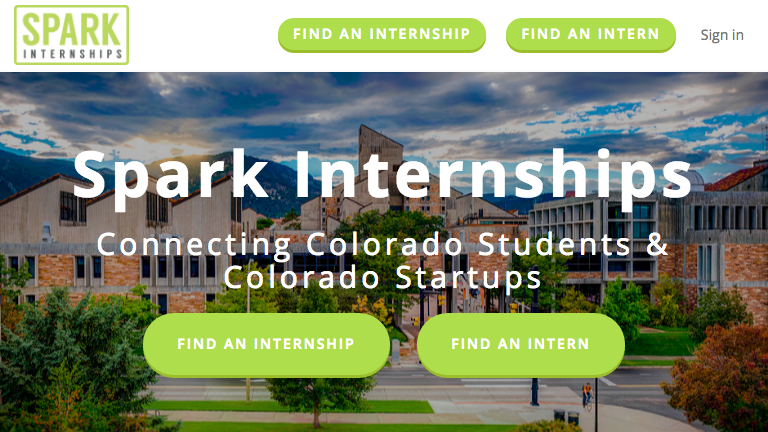
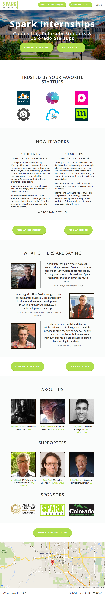
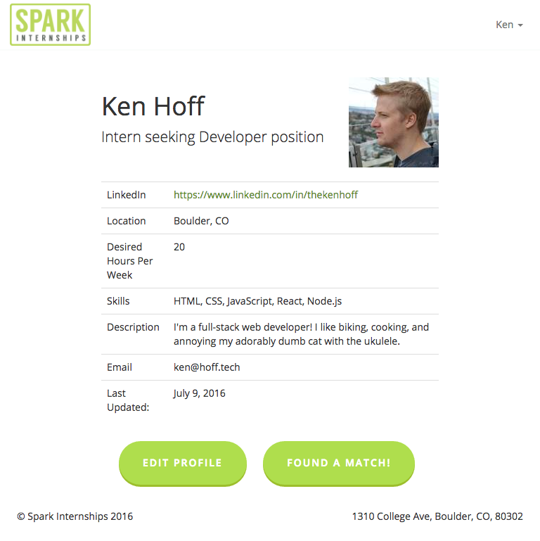

> "Ken has always impressed me with his project management skills and organization, when it comes to getting a site done. As a person who loves plans and structure he is amazing to work with."
>
> \- Arieann DeFazio, Executive Director at Spark Boulder

Have a look at the latest version of the site at [interns2startups.com](http://www.interns2startups.com/), or check out the screenshots below.

In May 2016, [Arieann DeFazio](https://www.linkedin.com/in/arieann) (Executive Director of [Spark Boulder](http://sparkboulder.com/)) approached me with a front-end web development project.

She was running **Spark Internships** (then called Interns2Startups), a program designed to connect entrepreneurial CU students with internships at local startups. Students could submit applications, and Spark Boulder would work with local startups to place the students in internships.

Spark Boulder was initially running Interns2Startups on [Squarespace](https://www.squarespace.com/), and students would submit applications through a form on the site. The form would send an email to the folks at Spark Boulder, who would work with the students and startups to find a match.

Spark Boulder was looking to move away from Squarespace, as it didn't provide the multiple-user platform that they needed. They already had a developer ([Allan McLelland](http://www.allans-workshop.com/blog/?p=199), woo!) generously donating his time to develop the whole application backend, and they were looking for someone to implement some front-end styling.

## Implementation deets

Spark Boulder wanted to keep the look of the main page on Squarespace, with the styling of the new admin and user pages to match.

Because website builders generally implement things in a [pretty bloated way](http://idlewords.com/talks/website_obesity.htm), I decided to avoid pulling the Squarespace site as-is and instead build it from scratch. I had to re-implement the whole page and all the CSS, but on the plus side, all the CSS was reusable for the admin and user pages.

In addition, I'd be able to fix some of the responsiveness errors that Squarespace has on these sites. **Rhombus!**

Starting from scratch, I implemented the entire front page in HTML and CSS before merging it with Allan's existing application. Then, I ported the CSS over to SASS, and started cranking away on styling all of the `*.erb` admin and user pages.

> Side note: still have no idea what `bundle install` does.

Most of the layout is done using Bootstrap's grid, but uses flexbox for some of the search results and really tricky layout bits. Unfortunately, really old browsers don't support flexbox, so all of those students on oil rigs running corporately-secured IE6 are out of luck :(

## Screenshots

