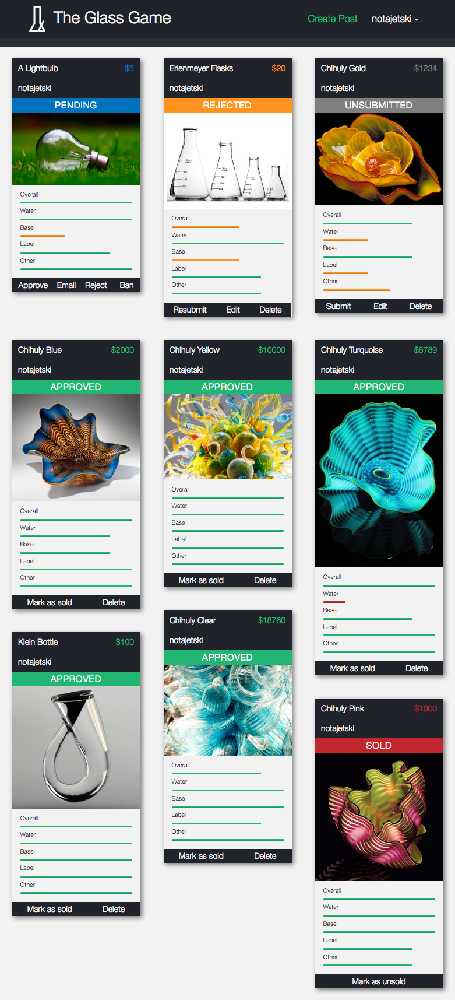

> "Working with Ken to develop my website was a fantastic experience. I came to Ken with an idea and some sketches and he transformed it into the exact website I imagined. Ken took the time to understand the industry I was going into and made sure to ask questions to clarify what I wanted if there was any confusion at all."
>
> "Ken kept me updated almost every day of the project with sketches and screenshots and written status reports making me feel like I knew exactly what was going on and could say or change something before it was created."
>
> "Ken is an extremely hardworking, kind and smart individual and I would not hesitate working with him for any project."
>
> \- Josh Reinstein, CEO of The Glass Game

Check out the finished version at [theglassgame.com](https://theglassgame.com/).

In July 2016, [Jake Hurwitz](https://www.linkedin.com/in/jake-hurwitz-6b39767b) (CEO of [Eyesight Creative](http://eyesightcreative.com/) and one of my coworkers at [Spark Boulder](http://sparkboulder.com/)) connected me with [Josh Reinstein](https://www.linkedin.com/in/joshuareinstein), who was looking for some full-stack web development.

Josh wanted to develop [The Glass Game](https://theglassgame.com/), a platform to connect buyers and sellers of high-end glassware. Users can scroll through glassware for sale, see prices, ratings, users, and contact sellers to arrange payment and transport.

Anyone can view all of the items for sale on the site. If a potential buyer wants to contact a seller, the buyer has to sign up for an account (using Facebook). If a user wants to post an item on the site, they have to upgrade to a seller account, and submit their post for approval. Once the admins on the site approve the post, potential buyers can contact the seller.

## Implementation deets

This was a fun one! It showcases a lot of different components that go into a web app (users, user-created content, authentication, authorization, payments, email, and more) as well as being visually heavy and interesting.

Josh already had a design in mind going into the project, which made design decisions a lot easier. Mobile support was the primary goal, but there wasn't really much that needed to change to accommodate desktop-sized browsers.

### Firebase Platform

The Glass Game was the first app that I've built that's run literally 100% on the [Firebase](https://firebase.google.com/) platform. I've built a number of games with the [realtime database](https://firebase.google.com/docs/database/), and I have Spark Boulder web dev students host their apps on [Firebase hosting](https://firebase.google.com/docs/hosting/), but this was the first time that I included [authentication](https://firebase.google.com/docs/auth/), [security rules](https://firebase.google.com/docs/database/security/), and [storage](https://firebase.google.com/docs/storage/).

### Masonry

A little ways into the project, we changed the design from a [grid](http://www.w3schools.com/css/css_rwd_grid.asp)-based layout to a [masonry](http://masonry.desandro.com/) layout. A typical grid layout follows the standard CSS box model pretty well, and can generally just overflow onto the next line without any issues. Because a masonry layout has varying heights for all the elements, it's unclear how the browser should wrap the content to the next line, so a bunch of JavaScript has to manage the whole thing using a lot of `position: absolute` styles and offsets.

Generally, this is totally fine for static content - set up masonry, give it a bunch of HTML, and tell it to render. If an element gets changed, tell it to re-render. However, because all of web development is basically just [hacks on hacks](https://news.ycombinator.com/item?id=12477190), things are never just this easy.

See, instead of passing just the full HTML for each post to masonry, I pass in a bunch of React components. (I'm abstracting a little bit, okay?) Each one of these React components doesn't render right away - it renders an empty div, listens for data, then fills in the div when it gets data.

So, when masonry renders our posts the first time, it's just rendering a bunch of empty divs. (No [intrinsic placeholders](http://daverupert.com/2015/12/intrinsic-placeholders-with-picture/) here!) When all of the fields are filled in, then the components rerender, which cause all of the divs to change height, and now masonry needs to be told to rerender. If the dimensions of _any_ post get changed, then masonry needs to rerender _again_.

Masonry can be pretty tricky to work with, but most of the time it [looks soooooo good](http://van-life.net/).

### Payments

Because Firebase is designed to be entirely client-side, this makes some things that are traditionally done on full-stack web apps (with backends and APIs) a little more difficult.

In any situation where you've got "secret keys" for any kind of service (authentication, authorization, database, payment processing, or mail/sms delivery), you usually hide this stuff behind an API so clients (browsers) don't have direct access to the service.

This made it a little tricky for us to do payments. Typically, the client would send a request to an server (with SSL, of course) along with payment information, and the server would make a request to [Stripe](https://stripe.com/) (our payment processing service) along with our secret key, which authenticates our server with Stripe.

(See, if we had included our Stripe secret key in the code for the client, then anyone could get that key and start making authenticated requests on our behalf to Stripe. Scary!)

I could have built a full backend for The Glass Game, but the only thing that we needed it for was Stripe and mail delivery with nodemailer. Enter [webtask](https://webtask.io/)!

[Webtask](https://webtask.io/) is a simplified version of [AWS Lambda](https://aws.amazon.com/lambda/) - write a function, upload it to webtask, then make an HTTP request to webtask to run the function. This makes it possible for us to hide secret keys behind the network layer, and we can give the webtask URL safely to the client.

### Modals

One unexpected bit of complexity that I ran into was scrollable modals on mobile browsers. `(╯°□°）╯︵ ┻━┻`

Turns out that overflow support for absolutely positioned objects on iOS Webkit is [notoriously bad](https://www.google.com/search?q=ios+modal+scroll).

Sometimes it'd work just fine! Sometimes, only the background would scroll. I had literally no idea why it decided to work one way or another. We figured out some workarounds by changing the height of the problematic modals, but it still bugs me that I wasn't quite able to figure it out.

I'm thinking that it stemmed from using Bootstrap, but I don't know for sure. Sounds like next time, I'm just gonna have to roll my own modals, or avoid using them altogether. **Rhombus!**

### Firebase Security Rules

So, for just about everything, Firebase was spectacular. Auth, realtime DB, storage - everything was really just awesome to use and worked perfectly.

Except for one tiny thing. [Security rules](https://firebase.google.com/docs/database/security/).

Security rules are the things that Firebase uses to ensure that only the right data is being written to the realtime DB by the right people. Otherwise, anybody could read/write any data that they wanted wherever they wanted, totally screwing up your app. Essentially, it's the authorization component of a standard web app.

In order to write security rules, you have to put together a valid JSON file that closely mirrors the structure of the data in your realtime DB, along with some `".read"` and `".write"` keys. This is generally pretty easy to grok.

The problems start to surface once the rules get a little more complicated. Say, for example, if you wanted someone to be able to "submit" their post for approval (e.g. change the "status" of the post to "pending"). They can't do that unless it's their own post, and they can't do it unless they have an active seller profile. Also, if a user wants to approve (set the "status" of the post to "approved") or reject (set the "status" of the post to "rejected"), then the user has to be an admin. All of these operations happen on the "status" field on the post.

And because Firebase's security rules use their own miniature inline language inside of JSON object values, I ended up with code like this:

```json
{
    ".validate": "((newData.val() == 'pending') && (root.child('users').child(auth.uid).child('expires').val() >= now)) || (newData.val() == 'unsubmitted') || (newData.val() == 'rejected') ||  (newData.val() == 'approved' && (root.child('users').child(auth.uid).child('admin').val() === true)) || (newData.val() == 'sold')"
}
```

Everything's working just fine now, but while developing and testing, I got so fed up with this format. Every time I made a change to a security rule, I had to re-upload them to Firebase. Then, when my app hit `401: Not Authorized` responses, Firebase gave me _literally zero_ debug information. **Nothing**. I couldn't even see a log of attempted requests to try and debug why this enormous, complicated security rule wasn't working at all.

I was frustrated enough to bug my friend at Google (thanks [Dane](https://www.larsendt.com/)) and he sent some feedback along to the Firebase team.

In the future, I'll probably continue using Firebase for games (see [Titan](/projects/titan) and [Bananacat's Maniac Mystery Mansion](/projects/maniac-mystery-mansion)), but it wouldn't be fair to my clients to continue using Firebase. Firebase as a platform is still wonderful, but if I have to bill my clients for time spent battling my own authorization system, I've failed as a consultant.

Sorry Firebase guys. `¯\_(ツ)_/¯` If you work on the Firebase team and want to get in touch about how to improve security rules, hit me up at <mailto:ken@hoff.tech>.

### All the techs

The Glass Game is a client-side app written in [React](https://facebook.github.io/react/) and [Stylus](http://stylus-lang.com/), using the [Firebase](http://firebase.google.com/) platform, including Realtime DB, Storage, Authentication and Hosting. Backend payment processing is handled by [webtask](https://webtask.io/) and [Stripe](https://stripe.com/). It's built using [webpack](https://webpack.github.io/), and continuously integrated/deployed to development/staging/production environments with [CircleCI](https://circleci.com/). Client-side image validation, resizing and autorotation is accomplished with [spooooky dark magic](https://blueimp.github.io/JavaScript-Load-Image/)!


